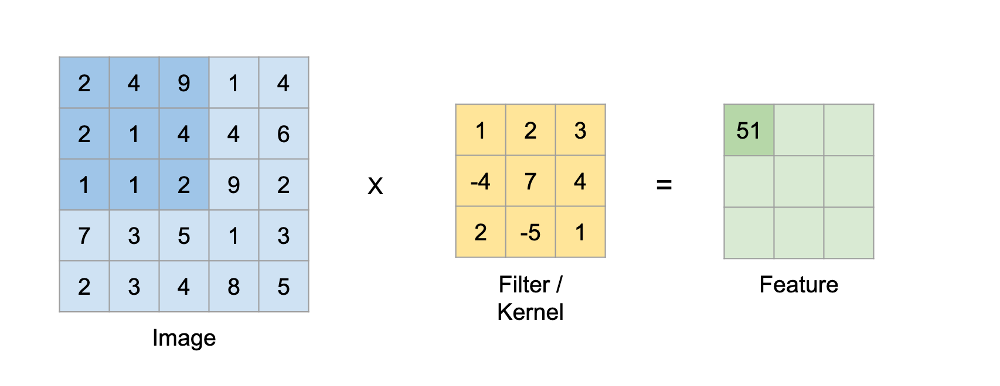

# Project Title

Fashion-MNIST Image Classifying Model

## Introduction

FashionMnist dataset is a dataset of Zalando's article images—consisting of a training set of 60,000 examples and a test set of 10,000 examples. Each example is a 28x28 grayscale image, associated with a label from 10 classes. The images are 28x28 NumPy arrays, with pixel values ranging from 0 to 255. The labels are an array of integers, ranging from 0 to 9.

### Labels
Each training and test example is assigned to one of the following labels:

| Label | Description |
| --- | --- |
| 0 | T-shirt/top |
| 1 | Trouser |
| 2 | Pullover |
| 3 | Dress |
| 4 | Coat |
| 5 | Sandal |
| 6 | Shirt |
| 7 | Sneaker |
| 8 | Bag |
| 9 | Ankle boot |

With given data we should develop a model, that will assign correct labels to given images of clothing.
Data provided by Zalando contains 70 000 images and labels. I will use 60 0000 images and labels to train a model and 10 000 to evaluate the quality of model.
I decided to use convolutional neural network (CNN) to solve the problem.


## Methods
I've decide to use Tensorflow library to develop my network.

###Loading the dataset
FashionMnist dataset exists in one of keras bulit-in datasets so I imported it from the package.
```
from keras.datasets import fashion_mnist
...
((X_train, y_train), (X_test, y_test)) = fashion_mnist.load_data()

```
###Preprocessing the data

The data must be preprocessed before training the network. Because the pixel values fall in the range of 0 to 255 I simply divided them by 255 to scale them to range of 0 to 1.
``` X_train = X_train.astype('float32')/255
    X_test = X_test.astype('float32')/255
```

### Preparing the model

Convolutional Neural Networks are essentially a type of neural network that is more accurate than regular Deep Neural Networks.
The two main concepts of this algorithm are Convolutions and Maxpooling.
Imagine we have an image that is an 2D array of 6x6 pixels.
The idea of a Convolutional Layer is to essentially create another grid of layers known as the kernel or filter.
So for example we have an 6x6 image and 3x3 kernel to filter the image. We are applying the kernel over the regions of the image
and performing kernel convolution over pixels.
Convolution is an operation of multiplying corresponding kernel and pixels values, summing them up and passing to another array called convoluted array.



Maxpooling is essentially reducing the size of an input image by summarizing regions. In order to perform maxpooling, we need to select two things: a grid, which would be the pool size, and a stride. We are scanning the image with our grid and choosing the greatest value within. The stride describes how many pixels the grid should slide across the image with each step.


Before passing the data to the model we should reshape it in order to pass it to Convolution Layer.

```
 X_train = X_train.reshape((X_train.shape[0], 28, 28, 1))
 X_test = X_test.reshape((X_test.shape[0], 28, 28, 1))
```
### Model

```
model = keras.Sequential([
       keras.layers.Conv2D(32, (3, 3), padding='same',
                           activation='relu', input_shape=(28, 28, 1)),
       keras.layers.MaxPooling2D((2, 2), strides=2),

       keras.layers.Conv2D(64, (3, 3), padding='same',
                           activation='relu'),
       keras.layers.MaxPooling2D((2, 2), strides=2),
       keras.layers.Flatten(),
       keras.layers.Dense(128, activation='relu'),
       keras.layers.Dense(10, activation='softmax')
   ])
```
After many attempts and test my model finally consists 2 Convolutional layers, 2 pooling layers and 2 Dense layers.

**Conv2D & MaxPooling2D**

In this layer we are applying 3x3 filter to our 28x28 sized images and returning 32 images of same size. 'relu' stands for Rectified Linear Unit and it is an activation function defined as the positive part of its argument. In a nutshell, activation function purpose is to introduce non-linear properties into the network.

Then we are reducing the size of them by
using MaxPooling2D layer with 2x2 sized grid and a stride of 2.

**Conv2D & MaxPooling2D**

With reduced size images we  are passing them once again to the convolutional layer. It will return 64 same sized images that are later reduced in size by same as before MaxPooling2D layer.
**Dense Layers**
With our preprocessed images we are passing them to our dense layers. Firstly we must transform the 28x28 array to 1D array of 784 pixels. After the pixels are flattened, the network consists of a sequence of two dense layers. These are densely connected, or fully connected, neural layers. The first Dense layer has 128 nodes (or neurons). The second layer returns a logits array with length of 10. Each node contains a score that indicates the current image belongs to one of the 10 classes. We are also using here the softmax activation function that will help to display the probabilities.

###Compile and training
**Compile**
```
model.compile(optimizer='adam',
                 loss='sparse_categorical_crossentropy',
                 metrics=['accuracy'])
```
Before training we must compile the model.

* Optimizer — An algorithm for adjusting the inner parameters of the model to minimize loss. Adam optimizer is an extension to stochastic gradient descent algorithm. Unlike stochastic gradient descent, adam changes learning rate during training.
* Loss function — An algorithm for measuring how far the model’s outputs are from the desired output. Categorical crossentropy is a loss function that is used for single label categorization. This is when only one category is applicable for each data point so it exactly fits the problem.
* Metrics — A metric is a function that is used to judge the performance of the model. Metric function is similar to loss functions, except that the results from evaluating a metric are not used when training the model. The following example uses accuracy, the fraction of the images that are correctly classified

**Training**
```
model.fit(X_train,
             y_train,
             batch_size=64,
             epochs=10)
```
We are training the model in 10 epochs, using 64 sized batches. Batch size describes number of samples per gradient update.

###Sources
Developing my network, I based on Tensorflow documentation, and non tested benchmarks on fashion_mnist github. At the beginning I developed simple deep neural network similar to shown on [Tensorflow tutorial](https://www.tensorflow.org/tutorials/keras/classification) and I reached quite good percentage of accuracy (~86%) but shortly after I decided to develop something more complex.

##Results

Using developed model I reached up 0.9224 accuracy with circa ~0.254 loss on my test data.


Official benchmark result site doesn't really include a result of training with Convolutional Neural Network but referring to untested but submitted benchmarks visible on fashion_mnist github we can see some examples of CNN models and their results.
In comparison to exemplary benchmark - CNN with 2 Conv and pooling I received similar results.

| Classifier | Preprocessing | Fashion test accuracy | Author |
|2 Conv+pooling | None | 0.876 | - | [Kashif Rasul](https://twitter.com/krasul)|
|2 Conv+pooling | None | 0.916| - |[Tensorflow's doc](https://www.tensorflow.org/tutorials/layers) |
|2 Conv+pooling+ELU activation (PyTorch)| None| 0.903| - | [@AbhirajHinge](https://github.com/AbhirajHinge) |
|2 Conv | Normalization, random horizontal flip, random vertical flip, random translation, random rotation. | 0.919 |[Kyriakos Efthymiadis](https://github.com/kefth)|
|2 Conv+pooling | Normalization | 0.9224 | [Piotr Swirkaitis](https://github.com/ptrswr)|

##Usage
In order to run the program following python libraries should be installed:
* tensorflow
* keras from tensorflow
* keras.datasets

Data is loaded directly from imported tensorflow.datasets package.
The program is written with python using Anaconda environment.
Python in version 3.7 is necessary to run it.
File cnn.py can be executed in console or any python framework like for example PyCharm.

## Author and License
Piotr Swirkaitis https://github.com/ptrswr

The MIT License (MIT) Copyright © [2017] Zalando SE, https://tech.zalando.com
